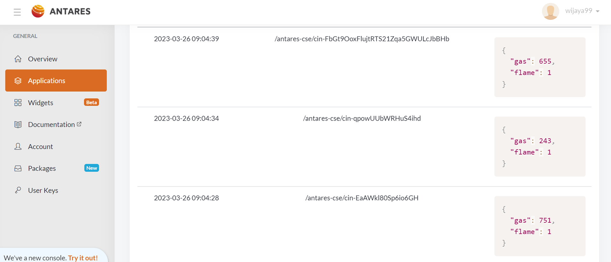
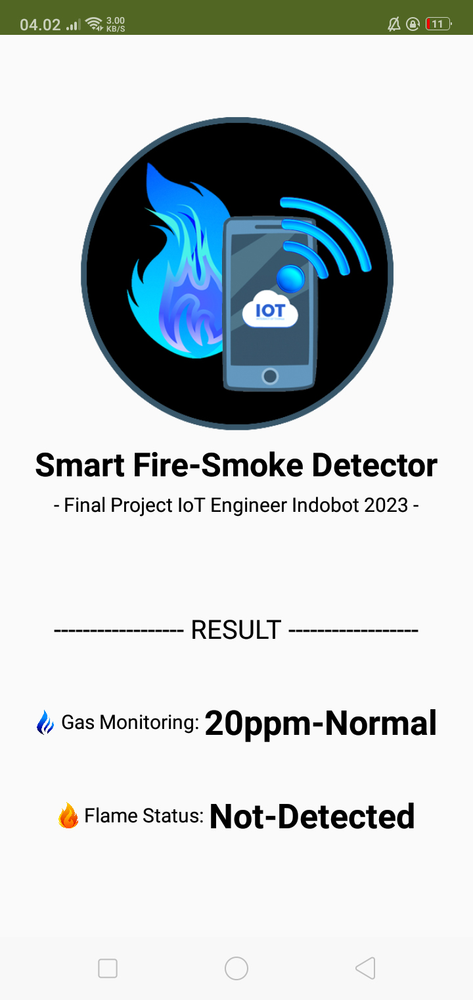

[](https://github.com/ellerbrock/open-source-badges/)
[](https://opensource.org/licenses/MIT)


# Smart-Fire-Smoke-Detector-Berbasis-IoT-Mobile
<strong>Tugas Akhir Indobot Academy: Kelas Awal untuk Menjadi Insinyur IoT yang Hebat Batch 1</strong><br/><br/>
Peningkatan penduduk di suatu negara merupakan salah satu modal pembangunan. Jumlah penduduk yang besar dapat memengaruhi perkembangan permukiman. Namun di sisi lain, permukiman yang tidak diimbangi dengan pengaturan yang baik dapat memicu terjadinya bencana, misalnya kebakaran. Bencana kebakaran yang terjadi dapat mengakibatkan kerugian materiil dan immateriil. Oleh karena itu, tujuan dari proyek ini tidak lain adalah untuk menghasilkan sebuah sistem deteksi kebakaran yang baik. Proyek ini telah dilaksanakan dan memakan waktu kurang lebih 2 minggu. Hasil penelitian menunjukkan bahwa sistem yang dibuat ini dapat berfungsi dengan baik. Antarmuka sistem menggunakan aplikasi MIT App Inventor.

<br><br>

## Kebutuhan Proyek
| Bagian | Deskripsi |
| --- | --- |
| Papan Pengembangan | Wemos D1 R2 |
| Editor Kode | Arduino IDE |
| Dukungan Aplikasi | MIT App Inventor |
| Driver | CH340 USB Driver |
| Platform IoT | Antares |
| Protokol Komunikasi | • Inter Integrated Circuit (I2C)<br>• Transmission Control Protocol/Internet Protocol (TCP/IP)<br>• Message Queuing Telemetry Transport (MQTT) |
| Arsitektur IoT | 4 Lapisan |
| Basis Data |  Firebase |
| Bahasa Pemrograman | C/C++ |
| Pustaka Arduino | • ESP8266WiFi (bawaan)<br>• Wire (bawaan)<br>• AntaresESP8266MQTT<br>• Firebase_Arduino_Client_Library_for_ESP8266_and_ESP32<br>• MQ2_LPG_Library<br>• LiquidCrystal_I2C |
| Aktuator | Piezo buzzer (x1) |
| Sensor | • KY-26: Sensor Api (x1)<br>• MQ-2: Sensor Gas (x1) |
| Layar | LCD I2C (x1) |
| Komponen Lainnya | • Kabel USB Mikro - USB tipe A (x1)<br>• Kabel jumper (1 set)<br>• Breadboard (x1)<br>• Kotak casing (x1) |

<br><br>

## Unduh & Instal
1. Arduino IDE

   <table><tr><td width="810">

   ```
   https://bit.ly/ArduinoIDE_Installer
   ```

   </td></tr></table><br>

2. CH340 USB Driver

   <table><tr><td width="810">

   ```
   https://bit.ly/CH340_USB_Driver
   ```

   </td></tr></table>
   
<br><br>

## Rancangan Proyek
<table>
<tr>
<th width="280">Diagram Skematik</th>
<th width="280">Diagram Ilustrasi</th>
<th width="280">Diagram Blok</th>
</tr>
<tr>
<td></td>
<td></td>
<td></td>
</tr>
</table>
<table>
<tr>
<th width="280">Infrastruktur</th>
<th width="280">Prototipe</th>
<th width="280">Diagram Sistem</th>
</tr>
<tr>
<td></td>
<td></td>
<td></td>
</tr>
</table>

<br><br>

## Pengetahuan Dasar
Perbedaan pinout pada papan Wemos D1 R1 dan R2 ditunjukkan dengan jelas pada gambar di bawah ini:
<table>
<tr>
<th width="420">Wemos D1 R1</th>
<th width="420">Wemos D1 R2</th>
</tr>
<tr>
<td></td>
<td></td>
</tr>
</table>

<br><br>

## Memindai Alamat I2C Yang Ada Pada LCD
```ino
#include <Wire.h>

void setup() {
  Wire.begin();
  Serial.begin(115200);
  while (!Serial); // Wait for serial monitor
  Serial.println("\nI2C Scanner");
}

void loop() {
  int nDevices = 0;
  Serial.println("Scanning...");

  for (byte address = 1; address < 127; ++address) {
    // The i2c_scanner uses the return value of the Wire.endTransmission to see if a device did acknowledge to the address.
    Wire.beginTransmission(address);
    byte error = Wire.endTransmission();

    if (error == 0) {
      Serial.print("I2C device found at address 0x");
      if (address < 16) {
        Serial.print("0");
      }
      Serial.print(address, HEX);
      Serial.println("  !");

      ++nDevices;
    } else if (error == 4) {
      Serial.print("Unknown error at address 0x");
      if (address < 16) {
        Serial.print("0");
      }
      Serial.println(address, HEX);
    }
  }
  if (nDevices == 0) {
    Serial.println("No I2C devices found\n");
  } else {
    Serial.println("done\n");
  }
  delay(5000); // Wait 5 seconds for next scan
}
```

<br><br>

## Kalibrasi Sensor MQ-2 Untuk Gas LPG
Tutorial kalibrasi sensor MQ-2 untuk Gas LPG: <a href="https://github.com/devancakra/MQ2_LPG_Library/blob/master/extras/Cara-Kalibrasi.md">Klik Disini</a>

<br><br>

## Pengaturan Arduino IDE
1. Buka ``` Arduino IDE ``` terlebih dahulu, kemudian buka proyek dengan cara klik ``` File ``` -> ``` Open ``` :

   <table><tr><td width="810"> 
      
      ``` Final_Project_Indobot_KelasMulaiJadiIoTEngineerHebat.ino ```

   </td></tr></table><br>
   
2. Isi ``` Url Pengelola Papan Tambahan ``` di Arduino IDE

   <table><tr><td width="810">
      
      Klik ``` File ``` -> ``` Preferences ``` -> masukkan ``` Boards Manager Url ``` dengan menyalin tautan berikut :
   
      ```
      http://arduino.esp8266.com/stable/package_esp8266com_index.json
      ```

   </td></tr></table><br>
   
3. ``` Pengaturan Board ``` di Arduino IDE

   <table>
      <tr><th width="810">

      Cara mengatur board ``` WEMOS D1 R2 ```
            
      </th></tr>
      <tr><td>
      
      • Klik ``` Tools ``` -> ``` Board ``` -> ``` Boards Manager ``` -> Instal ``` esp8266 ```.
      
      • Kemudian pilih Board dengan mengklik: ``` Tools ``` -> ``` Board ``` -> ``` ESP8266 Board ``` -> ``` LOLIN(WEMOS) D1 R2 & mini ```.

      </td></tr>
   </table><br>
   
4. ``` Ubah Kecepatan Papan ``` di Arduino IDE

   <table><tr><td width="810">
      
      Klik ``` Tools ``` -> ``` Upload Speed ``` -> ``` 115200 ```

   </td></tr></table><br>
   
5. ``` Instal Pustaka ``` di Arduino IDE

   <table><tr><td width="810">
      
      Unduh semua file zip pustaka. Kemudian tempelkan di: ``` C:\Users\Computer_Username\Documents\Arduino\libraries ```

   </td></tr></table><br>

6. ``` Pengaturan Port ``` di Arduino IDE

   <table><tr><td width="810">
      
      Klik ``` Port ``` -> Pilih sesuai dengan port perangkat anda ``` (anda dapat melihatnya di Device Manager) ```

   </td></tr></table><br>

7. Ubah ``` Nama WiFi ```, ``` Kata Sandi WiFi ```, dan sebagainya sesuai dengan apa yang anda gunakan saat ini.<br><br>

8. Sebelum mengunggah program, silakan klik: ``` Verify ```.<br><br>

9. Jika tidak ada kesalahan dalam kode program, silakan klik: ``` Upload ```.<br><br>

10. Jika masih ada masalah saat unggah program, maka coba periksa pada bagian ``` driver ``` / ``` port ``` / ``` yang lainnya ```.

<br><br>

## Pengaturan Antares
1. Memulai Antares :

   <table><tr><td width="810">
      
   • Silakan <a href="https://beta-console.antares.id/id/signup">Registrasi</a> terlebih dahulu.

   • Selanjutnya silakan <a href="https://beta-console.antares.id/id">Masuk</a> agar dapat mengakses layanan.

   </td></tr></table><br>
   
2. Mengaktifkan access key :

   <table><tr><td width="810">
      
   • Masuk ke menu ``` Account ```.

   • Klik ``` Get Access Key ``` untuk menghasilkan access key. Proses ini hanya perlu dilakukan sekali.

   • Jika anda sudah pernah mengaktifkan access key sebelumnya, lewati langkah ini.

   </td></tr></table><br>
   
3. Membuat applications :

   <table><tr><td width="810">
      
   • Masuk ke menu ``` Applications ```.

   • Klik ``` + Create an Application ```.

   • Dalam menu ``` Add Application ```, silakan menentukan beberapa hal berikut :
      - ``` Application Name ``` -> ``` Nama Aplikasi yang akan anda buat ```.
      - ``` Application ID ``` -> ``` ID Aplikasi yang akan anda buat ```.
      - ``` Labels ``` -> tentukan sesuai dengan kebutuhan proyek.

   </td></tr></table><br>
   
4. Membuat device :

   <table><tr><td width="810">
      
   • Pastikan anda berada di menu ``` Home / Applications / Aplikasi yang anda buat ```.

   • Klik ``` + Add Device ```.

   • Nama device ini sebaiknya anda tentukan berdasarkan variabel yang ada dalam proyek.

   </td></tr></table><br>
   
5. Konfigurasi firmware :

   <table><tr><td width="810">
      
   • Pastikan anda berada di menu ``` Account ```.

   • Salin ``` Access Key ``` tersebut.

   • Tempelkan pada kode firmware, contohnya seperti ini :

   ```ino
   #define ACCESSKEY "1444e88d02acb758:b996115b1c2f6f0f"
   ```

   • Kemudian, ``` Nama proyek ``` dan ``` Nama device ``` itu harus sesuai dengan yang telah dibuat tadi. Contohnya :
   
   ```ino
   #define projectName "Final_Project_Indobot_Academy_2023"
   #define deviceName "Smart_Fire_Smoke_Detector"
   ```

   </td></tr></table>
   
<br><br>

## Pengaturan Firebase
1. Buka situs resmi ``` Firebase ``` :

   <table><tr><td width="810">
   
   ```
   https://console.firebase.google.com/
   ```

   </td></tr></table><br>
   
2. Buat proyek dengan nama bebas.<br><br>

3. Klik ``` simbol gerigi ``` yang ada di samping ``` Project Overview ``` -> Lalu pilih ``` Project settings ``` untuk mendapatkan ``` FirebaseToken ```.<br><br>

4. Klik ``` Realtime Database ``` untuk mendapatkan ``` FirebaseURL ```.

<br><br>

## Pengaturan MIT App Inventor
1. Buka situs resmi ``` MIT App Inventor ``` :

   <table><tr><td width="810">
   
   ```
   https://appinventor.mit.edu/
   ```

   </td></tr></table><br>
   
2. Klik ``` Create Apps! ```, kemudian masuk dengan menggunakan akun google.<br><br>

3. Klik ``` Project ``` -> lalu impor berkas yang ada di direktori ``` Smart-Fire-Smoke-Detector-Berbasis-IoT-Mobile\Src\MIT App Inventor Project\ ``` :

   <table><tr><td width="810">

   ``` Smart_Fire_Smoke_Detector.aia ```

   </td></tr></table><br>

4. Klik ``` FirebaseDB1 ``` lalu atur 3 poin berikut ini :

   <table><tr><td width="810">
      
   • ``` FirebaseToken ``` -> isi dengan ``` Token ``` yang diperoleh dari bagian ``` Project settings ```.
   
   • ``` FirebaseURL ``` -> isi dengan ``` URL ``` yang diperoleh dari bagian ``` Realtime Database ```.
   
   • ``` ProjectBucket ``` -> isi dengan ``` Kontainer DB ```. Dalam hal ini adalah ``` Detect ```.

   </td></tr></table><br>

5. Kemudian klik ``` Connect ``` -> selanjutnya pilih ``` AI Companion ```.<br><br>

6. Buka ponsel cerdas anda, lalu pada ``` Google Play Store ``` cari aplikasi ``` MIT AI2 Companion ```, kemudian lakukan instalasi.<br><br>

7. Buka aplikasi ``` MIT AI2 Companion ```.<br><br>

8. Pilih metode ``` Scan QR Code ```.<br><br>

9. Arahkan ponsel cerdas anda ke area ``` QR Code ``` yang ada di situs ``` MIT App Inventor ```.

<br><br>

## Memulai
1. Unduh dan ekstrak repositori ini.<br><br>
   
2. Pastikan anda memiliki komponen elektronik yang diperlukan.<br><br>
   
3. Pastikan komponen anda telah dirancang sesuai dengan diagram.<br><br>
   
4. Konfigurasikan perangkat anda menurut pengaturan di atas.<br><br>

5. Selamat menikmati [Selesai].

<br><br>

## Sorotan
<table>
<tr>
<th width="210">MIT App Inventor</th>
<th width="210">Perangkat</th>
<th width="210">Firebase</th>
<th width="210">Antares</th>
</tr>
<tr>
<td></td>
<td></td>
<td></td>
<td></td>
</tr>
</table>
<table>
<tr>
<th colspan="2">Simulasi Pemantauan dengan Aplikasi Mobile</th>
</tr>
<tr>
<td width="420"></td>
<td width="420"></td>
</tr>
</table>

<br><br>

## Apresiasi
Jika karya ini bermanfaat bagi anda, maka dukunglah karya ini sebagai bentuk apresiasi kepada penulis dengan mengklik tombol ``` ⭐Bintang ``` di bagian atas repositori.

<br><br>

## Penafian
Aplikasi ini merupakan hasil karya saya sendiri dan bukan merupakan hasil plagiat dari penelitian atau karya orang lain, kecuali yang berkaitan dengan layanan pihak ketiga yang meliputi: kode editor, library, framework, dan lain sebagainya.

<br><br>

## LISENSI
LISENSI MIT - Hak Cipta © 2022 - Devan C. M. Wijaya, S.Kom

Dengan ini diberikan izin tanpa biaya kepada siapa pun yang mendapatkan salinan perangkat lunak ini dan file dokumentasi terkait perangkat lunak untuk menggunakannya tanpa batasan, termasuk namun tidak terbatas pada hak untuk menggunakan, menyalin, memodifikasi, menggabungkan, mempublikasikan, mendistribusikan, mensublisensikan, dan/atau menjual salinan Perangkat Lunak ini, dan mengizinkan orang yang menerima Perangkat Lunak ini untuk dilengkapi dengan persyaratan berikut:

Pemberitahuan hak cipta di atas dan pemberitahuan izin ini harus menyertai semua salinan atau bagian penting dari Perangkat Lunak.

DALAM HAL APAPUN, PENULIS ATAU PEMEGANG HAK CIPTA DI SINI TETAP MEMILIKI HAK KEPEMILIKAN PENUH. PERANGKAT LUNAK INI DISEDIAKAN SEBAGAIMANA ADANYA, TANPA JAMINAN APAPUN, BAIK TERSURAT MAUPUN TERSIRAT, OLEH KARENA ITU JIKA TERJADI KERUSAKAN, KEHILANGAN, ATAU LAINNYA YANG TIMBUL DARI PENGGUNAAN ATAU URUSAN LAIN DALAM PERANGKAT LUNAK INI, PENULIS ATAU PEMEGANG HAK CIPTA TIDAK BERTANGGUNG JAWAB, KARENA PENGGUNAAN PERANGKAT LUNAK INI TIDAK DIPAKSAKAN SAMA SEKALI, SEHINGGA RISIKO ADALAH MILIK ANDA SENDIRI.
